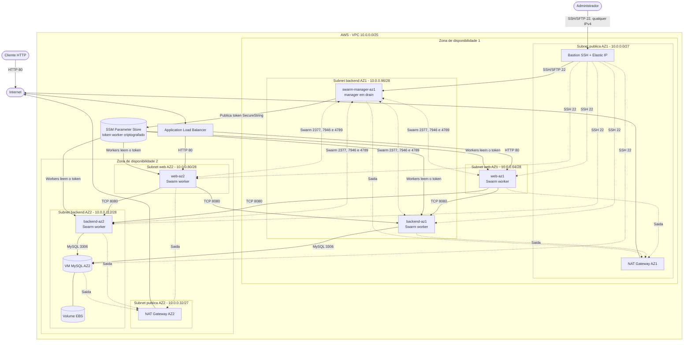

# Infraestrutura Lamar Auto Pecas



## Bootstrap automatico do Swarm

Durante a primeira inicializacao:

1. O manager instala Docker e AWS CLI, define o hostname `swarm-manager-az1` e executa `docker swarm init`.
2. O token de worker e salvo como `SecureString` em `/<EnvironmentName>/swarm/worker-token` no SSM Parameter Store.
3. As VMs web e backend aguardam o parametro e executam `docker swarm join` automaticamente.
4. O manager aplica as labels `tier=web|backend` e `zone=az1|az2` aos workers.
5. O manager permanece em `drain`, portanto nao executa os containers da aplicacao.

O IAM role contido em `InstanceProfileName` precisa permitir:

- `ssm:PutParameter` para o manager;
- `ssm:GetParameter` para os workers;
- `kms:Encrypt`, `kms:Decrypt` e `kms:GenerateDataKey` para o `SecureString`.

No ambiente AWS Academy, confirme essas permissoes no role associado ao `LabInstanceProfile`.

## Acesso SSH e SFTP

Ao criar a stack, informe:

- `KeyName`: nome de um par de chaves EC2 existente na regiao.

O bastion aceita conexoes SSH na porta 22 a partir de qualquer endereco IPv4 (`0.0.0.0/0`). A autenticacao continua exigindo a chave privada correspondente ao `KeyName`.

Use os outputs `BastionPublicIp` e `SwarmManagerPrivateIp`:

```sshconfig
Host lamar-bastion
    HostName IP_PUBLICO_BASTION
    User ubuntu
    IdentityFile C:/Users/Guilherme/.ssh/lamar.pem

Host lamar-manager
    HostName IP_PRIVADO_MANAGER
    User ubuntu
    IdentityFile C:/Users/Guilherme/.ssh/lamar.pem
    ProxyJump lamar-bastion
```

Envie e implante o arquivo da stack:

```bash
sftp lamar-manager
```

```text
put docker-swarm.yml /home/ubuntu/docker-swarm.yml
exit
```

```bash
ssh lamar-manager
sudo docker node ls
sudo docker stack deploy --with-registry-auth -c /home/ubuntu/docker-swarm.yml lamar
```

Este desenho usa um unico manager e e adequado para laboratorio. Alta disponibilidade exige tres managers, preferencialmente distribuidos em tres zonas de disponibilidade.
